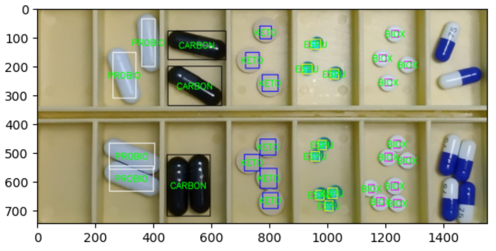
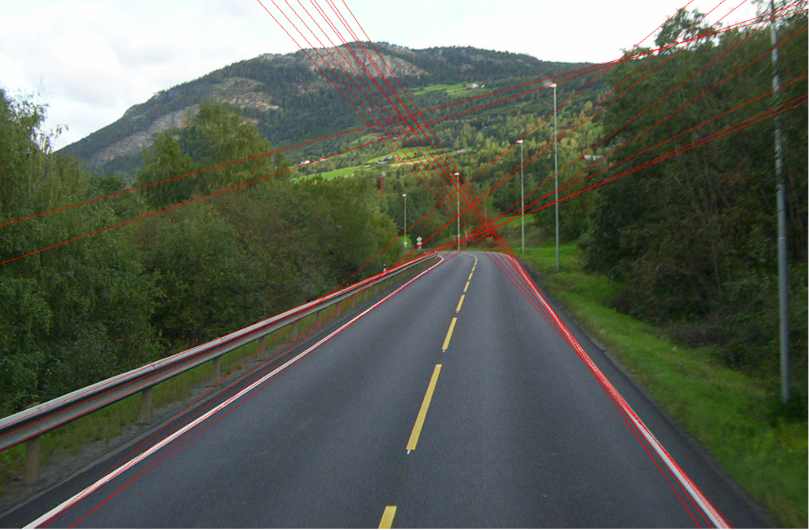
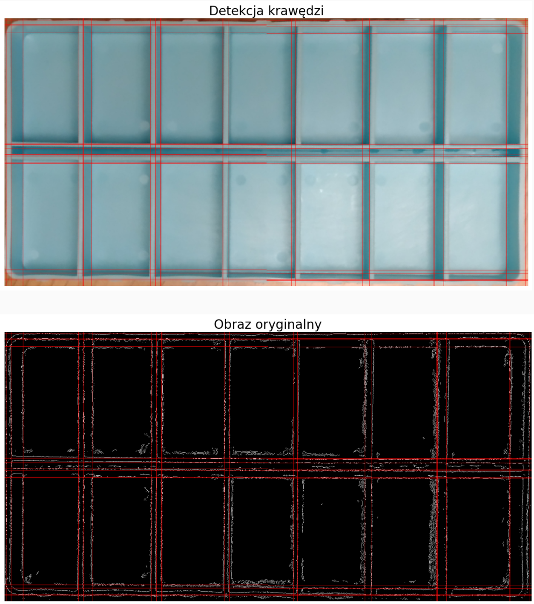

# Hough
This project focuses on utilizing the Hough transform for detecting lines and circles in images.
## Notebooks:

### - [`Pills segmentation`](Lab%205%20-%20zadanie-20231116%2FLab5_zadanie_Hough.ipynb)
- Pills detection and classification:

    

### - [`Hugh lines detection`](Lab%205%20-%20zadanie-20231116%2FLab5_zadanie.ipynb)
- Parameters overview:

    
  

- Detection of compartments lines in a pill box:

    

