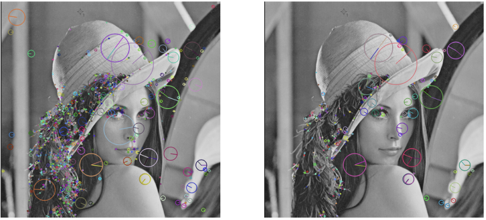

# Projekt Image Processing z wykorzystaniem SIFT i Image Stitching

## Opis projektu

Ten projekt skupia się na wykorzystaniu algorytmu SIFT (Scale-Invariant Feature Transform) do detekcji i opisu punktów kluczowych w obrazach, a także na technice image stitching do łączenia dwóch obrazów.

## Notebooks

1. **notebooks/:** Katalog zawierający notebooki Jupyter z realizacją poszczególnych etapów projektu.

   - `Lab6.1_zadanie.ipynb`: przegląd parametrów SIFT i ich wpływu na wyniki detekcji i dopasowania punktów kluczowych.
        - 

   - `Lab6.2_zadanie.ipynb`: 
     - dopasowywanie punktów kluczowych:
        - 
     - Detekcja i dopasowanie punktów kluczowych na obrazach z różnymi perspektywami:
        - 
     - Transformacja perspektywiczna, na podstawie dopasowanych punktów kluczowych:
        - 

2. **photos/:** Katalog zawierający przykładowe obrazy wykorzystane w projektach.

## Jak uruchomić notebooki

1. `pip install -r requirements.txt`.

