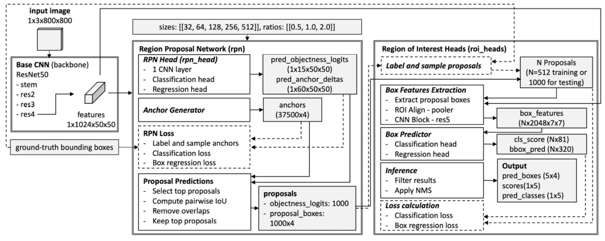
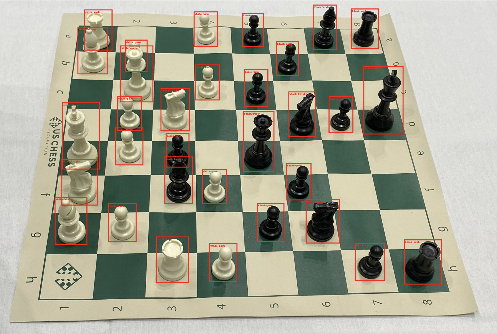
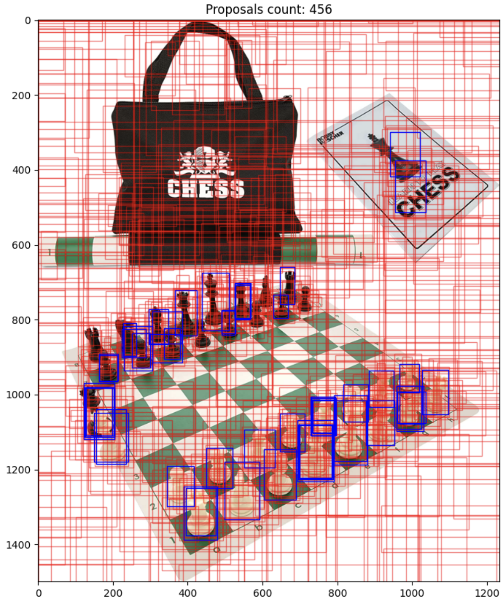

# Faster R-CNN ♟️
Faster R-CNN for chess pieces detection and classification.

**1. Dataset**
- [Chess Pieces Dataset](https://public.roboflow.com/object-detection/chess-full) (autorstwa Roboflow, domena publiczna)
**2. Model**
- Faster R-CNN model pretrained on COCO dataset.
- 
**3. Results**
- Detection and classification of chess pieces.
    - 
- Parameters overview.
    - 

