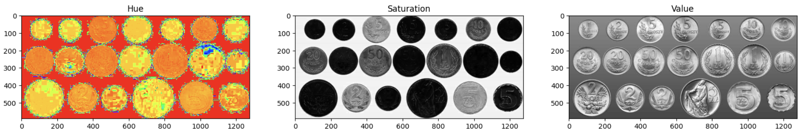
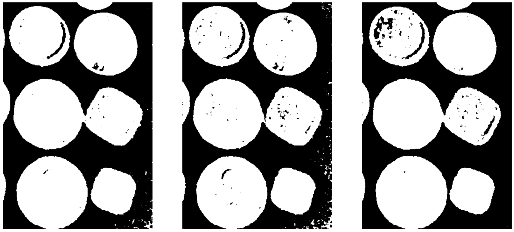
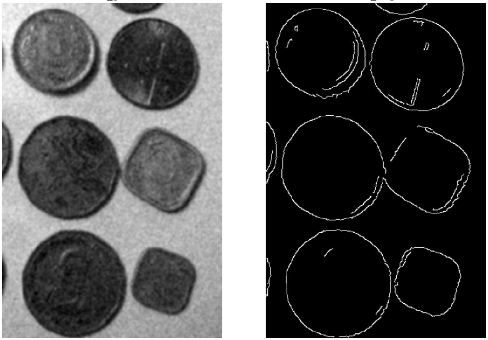
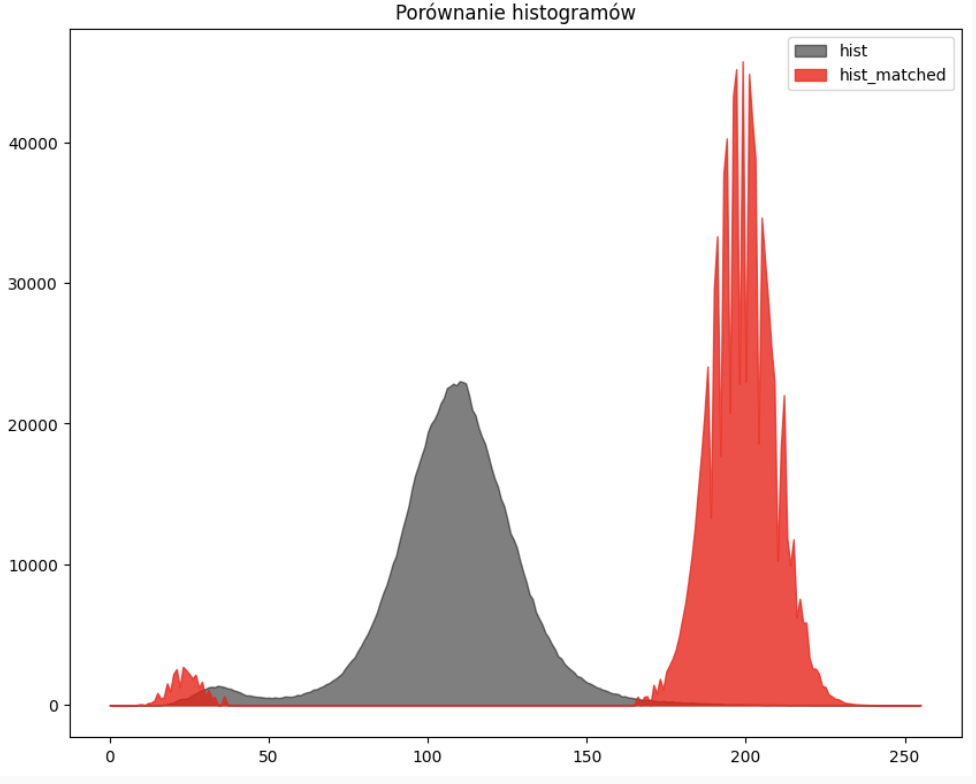
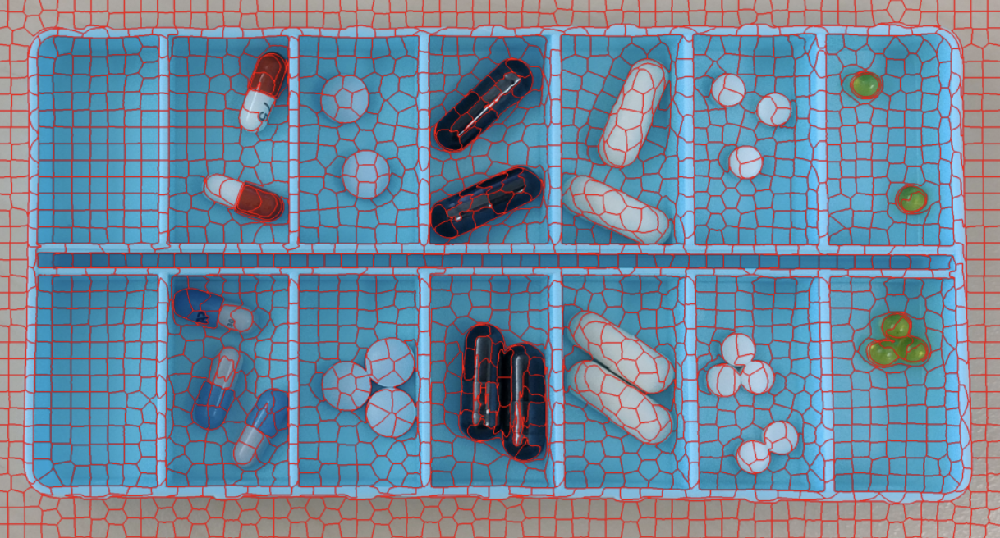
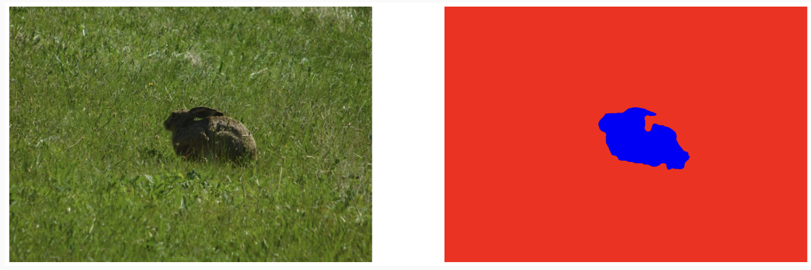
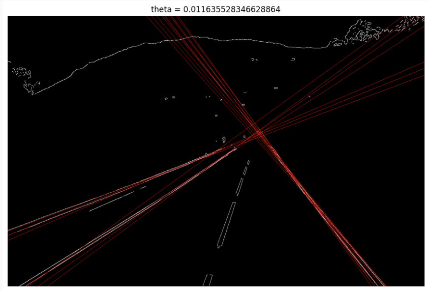
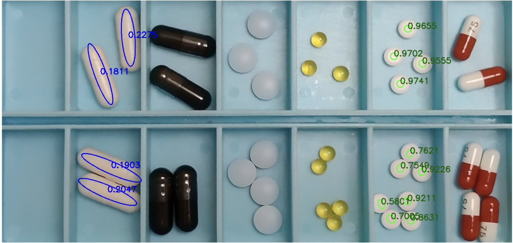
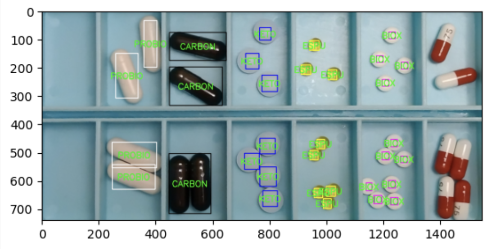
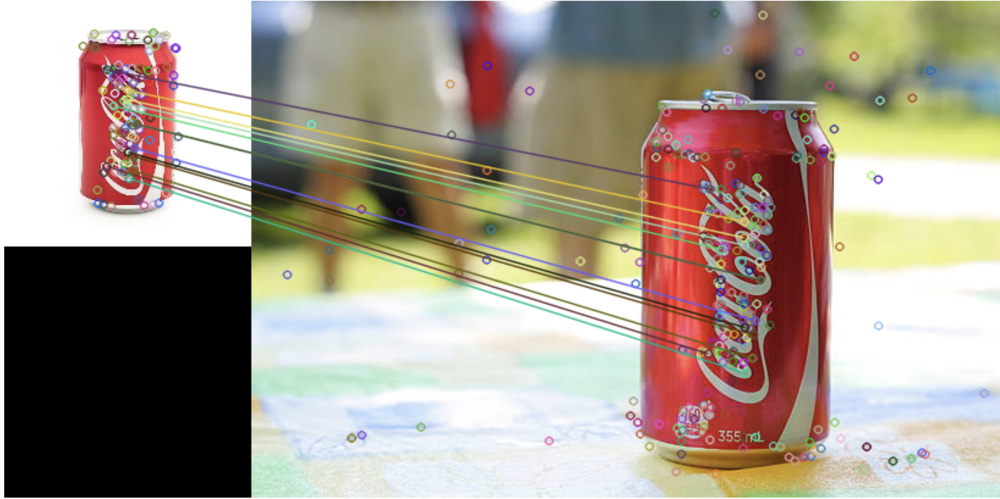

# Image and video analysis and processing 📷

This repository contains the code for the course Image and video analysis and processing (2023/24) of the Master in
Artificial Intelligence at the Wrocław University of Science and Technology 🧑‍🎓. The course primarily focuses on classical 
computer vision techniques and image processing. The repository is organized into eight labs, each dedicated to a 
different topic. These labs leverage the 
[OpenCV](https://opencv.org/)
and [Torchvision](https://pytorch.org/vision/stable/index.html)
libraries, as detailed in the [Technologies](#technologies) section.

## Table of contents

* [General info](#general-info)
* [Technologies](#technologies)
* [Contact](#contact)
* [License](#license)
* [References](#references)

## General info

This repository contains the code for the course Image and video analysis and processing (2023/24) of the Master in
Artificial Intelligence at the Wrocław University of Science and Technology.

### Notebooks:

1. **Basics of openCV**:
    * [`Podstawy_OpenCV.ipynb`](1%2FPodstawy_OpenCV.ipynb) - Basic of openCV.

2. **Binarization, image filtering:**
    * [`lab2-zadanie.ipynb`](2%2Flab2-zadanie.ipynb) - Global thresholding & adaptive thresholding.
    * 
    *   

3. **Edge detection, histogram equalization & matching:**
    * [`zadanie.ipynb`](3%2Fzadanie.ipynb) - Edge detection, Histogram matching.
        * 
        * 

4. **Slic superpixels, image segmentation:**
    * [`zadanie.ipynb`](4%2Fzadanie.ipynb) - Slic superpixels, image segmentation.
        * 
        * 

5. **Pills detection and classification:**
    * [`Lab5_zadanie_Hough.ipynb`](5%2FLab%205%20-%20zadanie-20231116%2FLab5_zadanie_Hough.ipynb) - Overview of
      parameters Hough lines detection.
        * 
    * [`Lab5_zadanie.ipynb`](5%2FLab%205%20-%20zadanie-20231116%2FLab5_zadanie.ipynb) - Pills detection and
      classification.
        * 
        * 

6. **SIFT and Image Stitching:**
    * [`Lab6.1_zadanie.ipynb`](6%2FLab%206%20-%20zadania-20231208%2FLab6.1_zadanie.ipynb) - Overview of SIFT parameters
      and their impact on key point detection and matching results.
        * 
    * [`Lab6.2_zadanie.ipynb`](6%2FLab%206%20-%20zadania-20231208%2FLab6.2_zadanie.ipynb) - Overview of SIFT parameters
      and their impact on key point detection and matching results.

7. **Detection using Faster-RCNN:**
    * To be added

8. **Optical Flow:**
    * To be added

## Technologies

* Python - version 3.8.5
* OpenCV - version 4.5.1
* Numpy - version 1.19.2
* Matplotlib - version 3.3.2
* Scikit-image - version 0.17.2
* Pillow - version 8.0.1
* Jupyter Notebook - version 6.1.4

## Contact

* Subject teacher: Przemysław Dolata
* Me: [Szymon Leszkiewicz](https://github.com/SzymonLeszkiewicz)

## License

This project is open source and available under the MIT License.

*[Back to top](#image-and-video-analysis-and-processing)*
